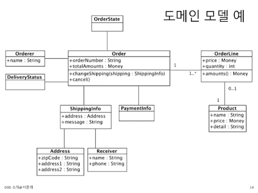

## 전략적 설계

### 전략적 설계란?
- 비즈니스 도메인을 매핑하고 도메인 모델에 대해 경계가 있는 컨텍스트를 정의한다.
- 소프트웨어의 설계를 진행할 때 전략적 설계가 우선적으로 진행된다.
- 전술보다 좀 더 큰 개념으로 소프트웨어의 기능에 대해 어떻게 활용하거나 비기능적인 목표들을 설정한다.
- `유비쿼터스 언어`를 정의한다.
- `Bounded Context`를 설계한다.
- `Context Map`을 통하여 프로젝트의 경계를 이해한다.

### 도메인 모델

- 특정 도메인을 개념적으로 표현한 것
- 도메인을 이해하는 데 도움이 된다면 표현 방식은 중요하지 않음
    - e.g. 클래스 다이어그램(UML), 그래프, 수학공식
- 데이터와 기능을 함께 보여주는 객체 모델은 도메인을 모델링하기에 적합
- 도메인 자체를 이해하기 위한 `개념 모델`을 의미
- 구현 기술에 맞는 `구현 모델`이 따로 필요함

### Bounded Context

- 도메인 모델은 특정한 Context에서 `완전한 의미`를 갖는다.
    - 하위 도메인마다 사용하는 용어와 의미가 다르면 같은 Context가 아니다.
    - 한 개의 모델로 모든 하위 도메인을 표현하려는 시도는 올바른 방법이 아니다.
    - 하위 도메인마다 모델을 만들어야 한다.
- 이렇게 구분되는 경계를 갖는 Context를 DDD에서는 `Bounded Context`라고 부른다.
- 모델의 경계를 결정하며 한 개의 Bounded Context는 논리적으로 한 개의 모델을 갖는다.

### Context Map

- 전체 비즈니스를 조망할 수 있는 지도
- Bounded Context의 `경계가 명확`하게 드러나고 서로 어떤 `관계`를 맺고 있는지 알 수 있다.
- Bounded Context 영역에 주요 애그리거트를 함께 표시하면 모델에 대한 관계가 더 명확히 드러난다.
- 시스템을 더 잘 이해하거나 시간이 지나면서 컨텍스트 간 관계가 바뀌면 컨텍스트 맵도 함께 바뀐다.

    - OHS: 오픈호스트서비스
    - ACL: Anti-Corruption Layer

[< back](../README.md)