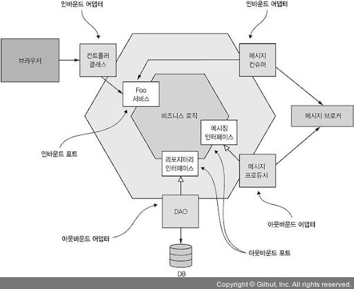
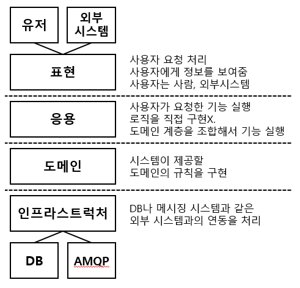
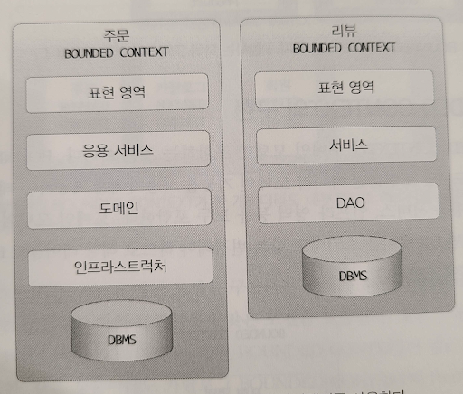
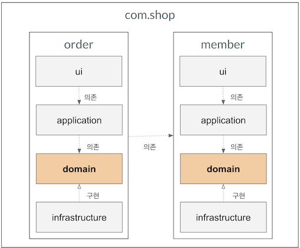
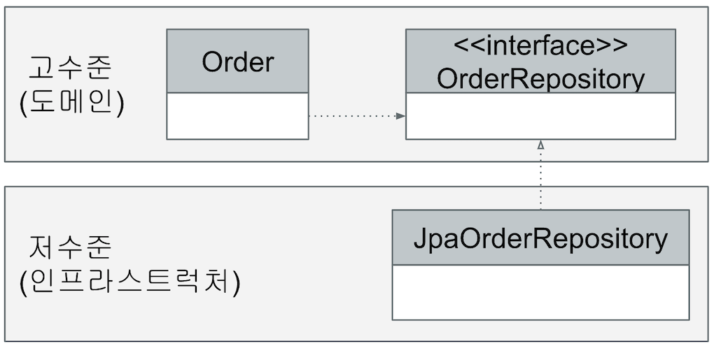
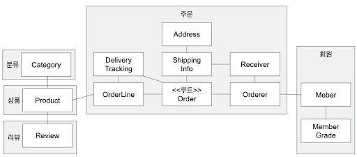

## 전술적 설계

### 전술적 설계란?
- 전략적 설계보다 더 상세하게 도메인 모델을 정의한다.
- DDD의 기반을 이루는 패턴을 사용해 전술적 측면에서 Bounded Context 내부를 모델링한다.
- 사용패턴
    - 엔티티, 밸류, 애그리거트, 리포지토리, 도메인 서비스
    
### 헥사고날 아키텍처

- 기능적 요구사항에 따라 애플리케이션 내부를 설계
    - UI, Infra는 그 다음이다.
    - 애플리케이션 내부가 캡슐화된다.
- 계층화 아키텍처의 대안
- 비즈니스 로직이 `표현, 데이터 접근 로직에 의존하지 않는다.`
- Adapter를 통해 기술과 분리
    - 인바운드: 외부에서 들어온 요청을 인바운드 포트를 호출해서 처리
        - e.g. Rest Controller, Command Handler, Event Consumer
    - 아웃바운드: 비즈니스 로직에서 들어온 요청을 외부 애플리케이션/서비스를 호출해서 처리
        - e.g. DAO, Proxy클래스, Event producer

### 소프트웨어 계층 구조


### 소프트웨어 계층 구조와 Bounded Context

- 도메인 모델 뿐만 아니라 도메인 기능을 사용자에게 제공하는 데 필요한 표현 영역, 응용 서비스, 인프라 영역 등도 모두 포함된다.
- 모든 Bounded Context를 반드시 DDD로 개발할 필요는 없다.
    - 도메인 기능이 단순하면 CRUD 방식으로 적용 가능
  
### 도메인 영역의 주요 구성요소
- 엔티티
    - 도메인 모델의 `데이터`와 관련된 `기능`을 함께 제공
    - e.g. 주문(Order), 회원(Member), 상품(Product)
- 밸류
    - 개념적으로 하나인 도메인 객체의 `속성`을 표현
    - e.g. 주소(Address), 금액(Money)
- 애그리거트
    - 관련된 엔티티와 밸류 객체를 `개념적으로 묶은 것`
    - e.g. 주문 애그리거트 = Order 엔티티 + OrderLine 밸류 + Orderer 밸류
- 리포지터리
    - 도메인 모델의 `영속성`을 처리
- 도메인 서비스 (Domain Service)
    - 특정 엔티티에 `속하지 않은` 도메인 로직을 제공

### 모듈 구성

- 

### 애그리거트
- 애그리거트 루트는 애그리거트 내부의 다른 객체를 조합해서 기능을 완성한다.
- 애그리거트 루트의 핵심 역할은 애그리거트의 `일관성`이 깨지지 않도록 하는 것이다.
- 애그리거트 루트는 애그리거트가 제공해야 할 도메인 기능을 구현한다.
- 개념상 완전한 한 개의 도메인 모델을 표현한다.
```java
// 애그리거트 루트 구현 예제
@Entity
@Table(name = "purchase_order")
public class Order {
  @EmbeddedId
  private OrderNo number;
  
  @Embedded
  private ShippingInfo shippingInfo;
  
  @Column(name = "state")
  @Enumerated(EnumType.STRING)
  private OrderState state;
  
  protected Order() {
  }
  
  private void setShippingInfo(ShippingInfo shippingInfo) {
    if (shippingInfo == null) {
      throw new IllegalArgumentException("no shipping info");
      this.shippingInfo = shippingInfo;
    }
  }
  
  public void changeShippingInfo(ShippingInfo shippingInfo) {
    verifyNotYetShipped();
    setShippingInfo(newShippingInfo);
  }
  
  private void verifyNotYetShipped() {
    if (!isNotYetShipped()) {
      throw new AlreadyShippedException();
    }
  }
  
  public boolean isNotYetShipped() {
    return state == OrderState.PAYMENT_WAITING || state == OrderState.PREPARING;
  }
}
```

### 애그리거트 경계
- 애그리거트는 복잡한 모델을 관리하는 기준 제공
- 도메인 기능을 확장하고 변경하는 데 필요한 노력(개발 시간)도 줄어 든다.
- 한 애그리거트에 속한 객체는 유사하거나 동일한 `Lifecycle`을 갖는다.
- 경계를 설정할 때 도메인 규칙과 요구사항이 기본
- 애그리거트 루트가 아닌 다른 객체가 애그리거트에 속한 객체를 직접 변경하면 일관성을 깨는 상황이 발생한다.

```java
// 애그리거트의 일관성을 깨는 상황
ShippingInfo shippingInfo = order.getShippingInfo();
shippingInfo.setAddress(newAddress);
```

### 리포지터리
- 리포지터리 기본 기능
  - ID로 애그리거트 조회하기
  - 애그리거트 저장하기
```java
// 리포지터리 인터페이스
public interface OrderRepository {
  Order findById(OrderNo id);
  void save(Order order);
  void remove(Order order);
}
```

```java
// JPA와 Spring을 이용한 리포지터리 구현
@Repository
public class JpaOrderRepository implements OrderRepository {
  @PersistenceContext
  private EntityManager entityManager;
  
  @Override
  public Order findById(OrderNo id) {
    return entityManager.find(Order.class, id);
  }
  
  @Override
  public void save(Order order) {
    entityManager.persist(order);
  }
  
  @Override
  public void remove(Order order) {
    entityManager.remove(order);
  }
}
```

### DIP (Dependency Inversion Principle)
- 의존 역전 원칙
- 고수준 모듈은 저수준 모듈의 구현에 의존해서는 안된다.
  - 저수준 모듈이 고수준 모듈에 의존
- 다른 영역이 인프라스트럭처 영역에 의존할 때 발생하는 두 가지 문제 해소 가능
  - 구현 교체가 어려움
  - 테스트가 어려움
- 고수준 모듈은 `추상화한 인터페이스에 의존`
- DIP를 잘 적용한 구조
  
  
  
### 엔티티와 DB 테이블의 매핑
- 엔티티와 밸류가 한 테이블로 매핑
  
  
  
### 엔티티와 밸류의 매핑

```java
// 애그리거트 루트는 엔티티이므로 @Entity로 매핑 설정한다.
@Entity
@Table(name = "purchase_order")
public class Order {
  @EmbeddedId
  private OrderNo number;
  
  @Version
  private long version;
  
  @Embedded
  private Orderer orderer;
  
  ...
}
```

```java
// 한 테이블에 엔티티와 밸류 데이터가 같이 있다면,
  // 밸류는 @Embeddable로 매핑 설정한다.
  // 밸류 타입 프로퍼티는 @Embedded로 매핑 설정한다.
@Embeddable
public class Orderer {
  @AttributeOverrides(
      @AttributeOverride(name = "id", column = @Column(name = "orderer_id"))
  )
  private MemberId memberId;
  
  ...
}
```

### 밸류 타입의 프로퍼티를 한 개의 DB 컬럼과 매핑
```java
// AttributeConverter 인터페이스를 사용하고 이를 구현한 클래스는 @Converter를 적용
public interface AttributeConverter<X, Y> {
  Y convertToDatabaseColumn(X var);
  X convertToDatabaseColumn(Y var);
}
```
```java
// autoApply = true는 타입 전체 적용
@Converter(autoApply = true)
public class MoneyConverter implements AttributeConverter<Money, Integer> {
  @Override
  public Integer convertToDatabaseColumn(Money money) {
    return (money != null) ? money.getValue() : null;
  }
  
  @Override
  public Money convertToEntityAttribute(Integer value) {
    return (value != null) ? new Money(value) : null;
  }
}
```
```java
// autoApply = false인 경우 아래와 같이 개별적으로 적용 가능
@Converter(converter = MoneyConverter.class)
private Money price;
```

### 밸류 컬렉션을 별도 테이블로 매핑
- 밸류 컬렉션을 별도 테이블로 매핑할 때는 @ElementCollection과 @CollectionTable을 함께 사용한다.
```java
@Entity
@Table(name = "purchase_order")
public class Order {
  @EmbeddedId
  private OrderNo number;
  
  @Version
  private long version;
  
  @ElementCollection
  @CollectionTable(name = "order_line", joinColumn = @JoinColumn(name = "order_number"))
  @OrderColumn(name = "line_idx")
  private List<OrderLine> orderLines;
}
```

### 리포지토리와 도메인 모델 구현 시 주의사항
- JPA의 @Entity와 @Embeddable로 클래스를 매핑하려면 기본 생성자를 제공해야 한다.
  - 하이버네이트와 같은 JPA 프로바이더는 DB에서 데이터를 읽어와 매핑된 객체를 생성할 때 기본 생성자를 사용해서 객체를 생성한다.
  - 다른 코드에서 기본 생성자를 사용하지 못하도록 protected로 선언한다.
- 엔티티는 외부에 set 메서드 대신 `의도가 잘 드러나는 기능을 제공`해야 한다.
- get/set 메서드를 추가하면 도메인의 의도가 사라지고 객체가 아닌 데이터 기반으로 엔티티를 구현할 가능성이 높아짐
  - set 메서드는 캡슐화를 깨는 원인이 됨

### 애그리거트 로딩 전략
- JPA 매핑을 설정할 때 애그리거트 루트에 속한 객체가 모두 모여 `완전한 상태`여야 한다.
  - 상태를 변경하는 기능을 실행할 때 애그리거트 상태가 완전해야 함.
  - 표현 영역에서 애그리거트의 상태 정보를 보여줄 때 필요하기 때문.
  ```java
  // product는 완전한 하나여야 한다.
  Product product = productRepository.findById(new ProductId(productId));
  }
  ```
- 상태 변경 기능을 실행하기 위해 조회 시점에 애그리거트를 완전한 상태로 로딩할 필요는 없다.
  - 실제로 상태를 변경하는 시점에 필요한 구성요소만 로딩해도 됨


### 연관 매핑 조회 방식 - 즉시 로딩

### 연관 매핑 조회 방식 - 지연 로딩
### 애그리거트 영속성 전파
### 애그리거트에 속한 엔티티 타입에 대한 매핑
### 식별자 생성 방식
### 검색을 위한 스펙
### 리포지터리 기능 구현 (Spring Data JPA)
### Spring Data JPA 계층 구조
### 리포지터리 기능 구현 (JPQL)
### 리포지터리 기능 구현 (QueryDSL)
### 응용 서비스
### 응용 서비스 구현 시 주의사항
### 응용 서비스의 책임
### 표현 영역
### 파라미터 값 검증
### 권한 검사
### 도메인 서비스
### 애그리거트 트랜잭션 관리
### 선점 잠금 (Pessimistic Lock)
### 비선점 잠금 (Optimistic Lock)
### Bounded Context 간 결합
### Bounded Context 간 관계
### 이벤트
### CQRS (명령 및 조회 책임 분리)

[< back](../README.md)
