## 전술적 설계

### 전술적 설계란?
- 전략적 설계보다 더 상세하게 도메인 모델을 정의한다.
- DDD의 기반을 이루는 패턴을 사용해 전술적 측면에서 Bounded Context 내부를 모델링한다.
- 사용패턴
    - 엔티티, 밸류, 애그리거트, 리포지토리, 도메인 서비스
    
### 헥사고날 아키텍처

- 기능적 요구사항에 따라 애플리케이션 내부를 설계
    - UI, Infra는 그 다음이다.
    - 애플리케이션 내부가 캡슐화된다.
- 계층화 아키텍처의 대안
- 비즈니스 로직이 `표현, 데이터 접근 로직에 의존하지 않는다.`
- Adapter를 통해 기술과 분리
    - 인바운드: 외부에서 들어온 요청을 인바운드 포트를 호출해서 처리
        - e.g. Rest Controller, Command Handler, Event Consumer
    - 아웃바운드: 비즈니스 로직에서 들어온 요청을 외부 애플리케이션/서비스를 호출해서 처리
        - e.g. DAO, Proxy클래스, Event producer

### 소프트웨어 계층 구조


### 소프트웨어 계층 구조와 Bounded Context

- 도메인 모델 뿐만 아니라 도메인 기능을 사용자에게 제공하는 데 필요한 표현 영역, 응용 서비스, 인프라 영역 등도 모두 포함된다.
- 모든 Bounded Context를 반드시 DDD로 개발할 필요는 없다.
    - 도메인 기능이 단순하면 CRUD 방식으로 적용 가능
  
### 도메인 영역의 주요 구성요소
- 엔티티
    - 도메인 모델의 `데이터`와 관련된 `기능`을 함께 제공
    - e.g. 주문(Order), 회원(Member), 상품(Product)
- 밸류
    - 개념적으로 하나인 도메인 객체의 `속성`을 표현
    - e.g. 주소(Address), 금액(Money)
- 애그리거트
    - 관련된 엔티티와 밸류 객체를 `개념적으로 묶은 것`
    - e.g. 주문 애그리거트 = Order 엔티티 + OrderLine 밸류 + Orderer 밸류
- 리포지터리
    - 도메인 모델의 `영속성`을 처리
- 도메인 서비스 (Domain Service)
    - 특정 엔티티에 `속하지 않은` 도메인 로직을 제공

### 모듈 구성

- 

### 애그리거트
- 애그리거트 루트는 애그리거트 내부의 다른 객체를 조합해서 기능을 완성한다.
- 애그리거트 루트의 핵심 역할은 애그리거트의 `일관성`이 깨지지 않도록 하는 것이다.
- 애그리거트 루트는 애그리거트가 제공해야 할 도메인 기능을 구현한다.
- 개념상 완전한 한 개의 도메인 모델을 표현한다.
```java
// 애그리거트 루트 구현 예제
@Entity
@Table(name = "purchase_order")
public class Order {
  @EmbeddedId
  private OrderNo number;
  
  @Embedded
  private ShippingInfo shippingInfo;
  
  @Column(name = "state")
  @Enumerated(EnumType.STRING)
  private OrderState state;
  
  protected Order() {
  }
  
  private void setShippingInfo(ShippingInfo shippingInfo) {
    if (shippingInfo == null) {
      throw new IllegalArgumentException("no shipping info");
      this.shippingInfo = shippingInfo;
    }
  }
  
  public void changeShippingInfo(ShippingInfo shippingInfo) {
    verifyNotYetShipped();
    setShippingInfo(newShippingInfo);
  }
  
  private void verifyNotYetShipped() {
    if (!isNotYetShipped()) {
      throw new AlreadyShippedException();
    }
  }
  
  public boolean isNotYetShipped() {
    return state == OrderState.PAYMENT_WAITING || state == OrderState.PREPARING;
  }
}
```

### 애그리거트 경계
- 애그리거트는 복잡한 모델을 관리하는 기준 제공
- 도메인 기능을 확장하고 변경하는 데 필요한 노력(개발 시간)도 줄어 든다.
- 한 애그리거트에 속한 객체는 유사하거나 동일한 `Lifecycle`을 갖는다.
- 경계를 설정할 때 도메인 규칙과 요구사항이 기본
- 애그리거트 루트가 아닌 다른 객체가 애그리거트에 속한 객체를 직접 변경하면 일관성을 깨는 상황이 발생한다.


- 애그리거트 경계 표현  
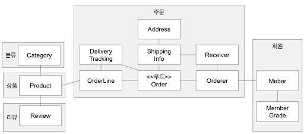

```java
// 애그리거트의 일관성을 깨는 상황
ShippingInfo shippingInfo = order.getShippingInfo();
shippingInfo.setAddress(newAddress);
```

### 리포지터리
- 리포지터리 기본 기능
  - ID로 애그리거트 조회하기
  - 애그리거트 저장하기
```java
// 리포지터리 인터페이스
public interface OrderRepository {
  Order findById(OrderNo id);
  void save(Order order);
  void remove(Order order);
}
```

```java
// JPA와 Spring을 이용한 리포지터리 구현
@Repository
public class JpaOrderRepository implements OrderRepository {
  @PersistenceContext
  private EntityManager entityManager;
  
  @Override
  public Order findById(OrderNo id) {
    return entityManager.find(Order.class, id);
  }
  
  @Override
  public void save(Order order) {
    entityManager.persist(order);
  }
  
  @Override
  public void remove(Order order) {
    entityManager.remove(order);
  }
}
```

### DIP (Dependency Inversion Principle)
- 의존 역전 원칙
- 고수준 모듈은 저수준 모듈의 구현에 의존해서는 안된다.
  - 저수준 모듈이 고수준 모듈에 의존
- 다른 영역이 인프라스트럭처 영역에 의존할 때 발생하는 두 가지 문제 해소 가능
  - 구현 교체가 어려움
  - 테스트가 어려움
- 고수준 모듈은 `추상화한 인터페이스에 의존`
- DIP를 잘 적용한 구조
  
  
  
### 엔티티와 DB 테이블의 매핑
- 엔티티와 밸류가 한 테이블로 매핑
  
  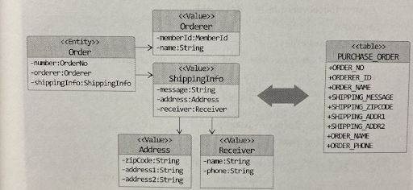
  
### 엔티티와 밸류의 매핑

```java
// 애그리거트 루트는 엔티티이므로 @Entity로 매핑 설정한다.
@Entity
@Table(name = "purchase_order")
public class Order {
  @EmbeddedId
  private OrderNo number;
  
  @Version
  private long version;
  
  @Embedded
  private Orderer orderer;
  
  ...
}
```

```java
// 한 테이블에 엔티티와 밸류 데이터가 같이 있다면,
  // 밸류는 @Embeddable로 매핑 설정한다.
  // 밸류 타입 프로퍼티는 @Embedded로 매핑 설정한다.
@Embeddable
public class Orderer {
  @AttributeOverrides(
      @AttributeOverride(name = "id", column = @Column(name = "orderer_id"))
  )
  private MemberId memberId;
  
  ...
}
```

### 밸류 타입의 프로퍼티를 한 개의 DB 컬럼과 매핑
```java
// AttributeConverter 인터페이스를 사용하고 이를 구현한 클래스는 @Converter를 적용
public interface AttributeConverter<X, Y> {
  Y convertToDatabaseColumn(X var);
  X convertToDatabaseColumn(Y var);
}
```
```java
// autoApply = true는 타입 전체 적용
@Converter(autoApply = true)
public class MoneyConverter implements AttributeConverter<Money, Integer> {
  @Override
  public Integer convertToDatabaseColumn(Money money) {
    return (money != null) ? money.getValue() : null;
  }
  
  @Override
  public Money convertToEntityAttribute(Integer value) {
    return (value != null) ? new Money(value) : null;
  }
}
```
```java
// autoApply = false인 경우 아래와 같이 개별적으로 적용 가능
@Converter(converter = MoneyConverter.class)
private Money price;
```

### 밸류 컬렉션을 별도 테이블로 매핑
- 밸류 컬렉션을 별도 테이블로 매핑할 때는 @ElementCollection과 @CollectionTable을 함께 사용한다.
```java
@Entity
@Table(name = "purchase_order")
public class Order {
  @EmbeddedId
  private OrderNo number;
  
  @Version
  private long version;
  
  @ElementCollection
  @CollectionTable(name = "order_line", joinColumn = @JoinColumn(name = "order_number"))
  @OrderColumn(name = "line_idx")
  private List<OrderLine> orderLines;
}
```

### 리포지토리와 도메인 모델 구현 시 주의사항
- JPA의 @Entity와 @Embeddable로 클래스를 매핑하려면 기본 생성자를 제공해야 한다.
  - 하이버네이트와 같은 JPA 프로바이더는 DB에서 데이터를 읽어와 매핑된 객체를 생성할 때 기본 생성자를 사용해서 객체를 생성한다.
  - 다른 코드에서 기본 생성자를 사용하지 못하도록 protected로 선언한다.
- 엔티티는 외부에 set 메서드 대신 `의도가 잘 드러나는 기능을 제공`해야 한다.
- get/set 메서드를 추가하면 도메인의 의도가 사라지고 객체가 아닌 데이터 기반으로 엔티티를 구현할 가능성이 높아짐
  - set 메서드는 캡슐화를 깨는 원인이 됨

### 애그리거트 로딩 전략
- JPA 매핑을 설정할 때 애그리거트 루트에 속한 객체가 모두 모여 `완전한 상태`여야 한다.
  - 상태를 변경하는 기능을 실행할 때 애그리거트 상태가 완전해야 함.
  - 표현 영역에서 애그리거트의 상태 정보를 보여줄 때 필요하기 때문.
  ```java
  // product는 완전한 하나여야 한다.
  Product product = productRepository.findById(new ProductId(productId));
  }
  ```
- 상태 변경 기능을 실행하기 위해 조회 시점에 애그리거트를 완전한 상태로 로딩할 필요는 없다.
  - 실제로 상태를 변경하는 시점에 필요한 구성요소만 로딩해도 됨

### 연관 매핑 조회 방식 - 즉시 로딩
- 즉시 로딩 (FetchType.EAGER)
  - 장점: 애그리거트 루트에 속한 객체를 함께 로딩할 수 있다.
  - 단점: 쿼리 결과에 중복을 발생시킬 수 있어 조회 성능이 나빠질 수 있다.
```java
  // 즉시 로딩 JPA 구현
  @OneToMany(cascade = {CascadeType.PERSIST, CascadeType.REMOVE}
        , orphanRemoval = true, fetch = FetchType.EAGER)
  @JoinColumn(name = "product_id")
  @OrderColumn(name = "list_idx")
  private List<Image> images = new ArrayList<>();
```
```sql
  -- 실제 쿼리
  Hibernate: 
  SELECT ...
  FROM user user0_
  LEFT OUTER JOIN post posts1_
  ON user0_.seq=posts1_.user_seq
  WHERE user0_.seq=?
```

### 연관 매핑 조회 방식 - 지연 로딩
- 지연 로딩 (FetchType.LAZY)
  - 장점: 추가 쿼리로 인한 실행 속도 저하는 문제가 되지 않는다.
  - 단점: @Entity나 @Embeddable에 대해 다르게 동작하고, JPA 프로바이더에 따라 구현 방식이 다를 수도 있다.
```java
  // 지연 로딩 JPA 구현
  @OneToMany(cascade = {CascadeType.PERSIST, CascadeType.REMOVE}
        , orphanRemoval = true, fetch = FetchType.LAZY)
  @JoinColumn(name = "product_id")
  @OrderColumn(name = "list_idx")
  private List<Image> images = new ArrayList<>();
```
```sql
  -- 실제 쿼리
  Hibernate: 
  SELECT ...
  FROM user user0_
  WHERE user0_.seq=?
  
  Hibernate:
  SELECT ...
  FROM post posts0_
  WHERE posts0_.user_seq=?
```
### 애그리거트 영속성 전파
- 저장 메서드는 애그리거트에 속한 모든 객체를 저장해야 한다.
- 삭제 메서드는 애그리거트에 속한 모든 객체를 삭제해야 한다.
- 애그리거트에 속한 밸류가 @Embeddable 매핑 타입인 경우 함께 저장되고 삭제된다.

### 애그리거트에 속한 엔티티 타입에 대한 매핑
- Cascade 속성을 사용해서 저장과 삭제 시에 함께 처리되도록 설정 필요
- JPA의 @OneToOne, @OneToMany에 CascadeType.PERSIST, CascadeType.REMOVE 설정
```java
  @OneToMany(cascade = {CascadeType.PERSIST, CascadeType.REMOVE}
        , orphanRemoval = true, fetch = FetchType.EAGER)
  @JoinColumn(name = "product_id")
  @OrderColumn(name = "list_idx")
  private List<Image> images = new ArrayList<>();
```

### 식별자 생성 방식
- 사용자가 직접 생성
  - 이메일 주소처럼 사용자가 직접 식별자를 입력하는 경우
- 도메인 로직으로 생성
  - 주문번호 = 고객ID + 타임스탬프
- DB를 이용한 일력번호 사용(JPA)
  @GeneratedValue 사용 (DB의 자동 증가 컬럼)
```java
  public class Article {
    @Id
    @GeneratedValue(strategy = GenerationType.IDENTITY)
    private Long id;
  }
```

### 검색을 위한 스펙
- 검색 조건의 조합이 다양해지면 모든 조합별로 find 메서드를 정의하기 어렵다.
- 스펙(Specification)은 애그리거트가 특정 조건을 충족하는지 여부를 검사
  - 스펙 인터페이스를 정의하고 애그리거트를 위한 스펙을 구현한다.
- 스펙 조합
  - 두 스펙을 AND나 OR 연산자로 조합해서 새로운 스펙을 만들 수 있고, 더 복잡한 스펙을 만들 수 있다. 
```java
  // 검색을 위한 스펙 예제
  public interface Specification<T> {
    boolean isSatisfiedBy(T o);
  }
```
```java
  public class TimeUpBundleRequestSpec implements Specification<BundleRequest> {
    @Override
    public boolean isSatisfiedBy(BundleRequest br) {
      return br.getBundlingTimeTolerance().isBefore(Instant.now());
    }
  }
```
```java
  public List<BundleRequest> getCandidates() {
    Specification<BundleRequest> timeUpSpec = new TimeUpBundleRequestSpec();
    
    // 묶음 허용 시간에 도달한 묶음 요청을 필터링한다
    return brRepository.findByStatus(BundlingStatus.IN_WAITING)
        .stream().filter(timeUpSpec::isSatisfiedBy).collect(toList());
  }
```

### 리포지터리 기능 구현 (Spring Data JPA)
- Spring Data JPA는 JPA를 추상화시킨 JpaRepository라는 인터페이스를 제공한다.
- 인터페이스만 작성하면 동적으로 구현체를 생성해서 주입
- 인터페이스만 작성해도 개발을 완료할 수 있다.
- 메서드 이름으로 쿼리 생성
  - 정해진 규칙이 있다. e.g. findById()
```java
  Optional<BundleRequest> findBySubjectId(@Param("subjectId") String subjectId);

  List<BundleRequest> findByStatus(@Param("status") BundlingStatus status);
  ...
```

### Spring Data JPA 계층 구조

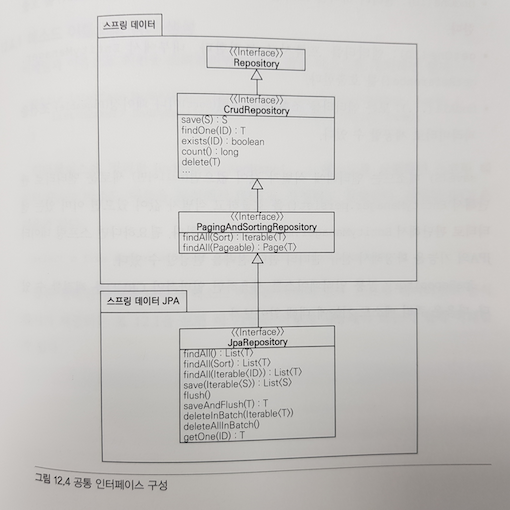

### 리포지터리 기능 구현 (JPQL)
- Java Persistence Query Language
- @Query 어노테이션을 사용해서 직접 JPQL을 지정할 수 있다.
  - @Query 지정 시 애플리케이션 로딩 시점에 쿼리를 검증하므로, 런타임 에러를 내지 않을 수 있따.
```java
  public interface MemberRepository {
    List<Member> findAll(Specification<Member> spec,
            List<SortOrder> orders,
            int startRow, int maxResults);
    
    Member findById(MemberId memberId);
    
    @Query(value = "select a from Member a where a.name = ?1", nativeQuery = true)
    List<Member> findByMemberName(String memberName);
  }
```

### 리포지터리 기능 구현 (QueryDSL)
- SQL, JPQL을 코드로 작성할 수 있도록 도와주는 빌더 API
- 코드로 작성하고 컴파일 시점에 문법 오류를 발견할 수 있다.
- 단순하고 쉽다. 코드 모양이 JPQL과 거의 비슷하다.
- 동적 쿼리 적용이 수월하다.
```java
  JPAQueryFactory queryFactory = new JPAQueryFactory(em);
  QMember member = QMember.member;
  
  Member foundMember = 
    queryFactory.selectFrom(member) // select * from
    .where(customer.username.eq("pagesoma"))
    .fetchOne();
```

### 응용 서비스
- 사용자에게 기능을 제공하려면 도메인과 사용자를 연결해 줄 표현 영역과 응용 영역이 필요하다.
- 응용 서비스는 사용자(클라이언트)가 요청한 기능을 실행한다.
- 응용 서비스에는 도메인 로직은 넣지 않는다.
  - 코드가 중복되는 문제를 방지하기 위함
- 표현 영역과 도메인 영역을 연결하는 매개체 역할
  - 퍼사드(facade) 패턴과 같은 역할
```java
  @Service
  public class CancelOrderService {
    private OrderRepository orderRepository;
    private RefundService refundService;
    private CancelPolicy cancelPolicy;
    
    @Transactional
    public void cancel(OrderNo orderNo, Canceller canceller) {
      Order order = findOrder(orderNo);
      if (!cancelPolicy.hasCancellationPermission(order, canceller)) {
        throw new NoCancellablePermission();
      }
      order.cancel();
    }
    ...
  }
```

### 응용 서비스 구현 시 주의사항
- 크기에 따른 구현방법
  - 한 응용 서비스 클래스에 회원 도메인의 모든 기능 구현하기
  - 구분되는 기능별로 응용 서비스 클래스를 따로 구현하기
- 인터페이스 필요성
  - TDD 개발 방식에서는 필요할 수 있으나, DDD 개발 방식에서는 필요성이 약화됨
- 메서드 파라미터와 값 리턴
  - 데이터 클래스를 파라미터로 전달받고 필요한 데이터를 추출해서 필요한 기능을 구현하면 된다.
- 표현 영역에 의존하지 않기
  - 파라미터 타입을 결정할 때 표현 영역과 관련된 타입을 사용하면 안된다.
  - HttpServletRequest, HttpSession을 응용 서비스에 파라미터로 전달하면 안된다.

### 응용 서비스의 책임
- 트랜잭션 처리
  - 트랜잭션을 관리하는 것은 응용 서비스의 중요한 역할
  - 스프링 프레임워크를 사용하면 @Transactional 사용
- 도메인 이벤트 처리
  - 도메인 영역에서 발생시킨 이벤트를 처리
  
### 표현 영역
- 사용자(외부시스템)가 제공된 시스템을 사용할 수 있는 흐름을 제공하고 제어
- 사용자의 요청을 해당 응용 서비스에 전달하고 결과를 사용자에게 제공
- 사용자의 세션을 관리

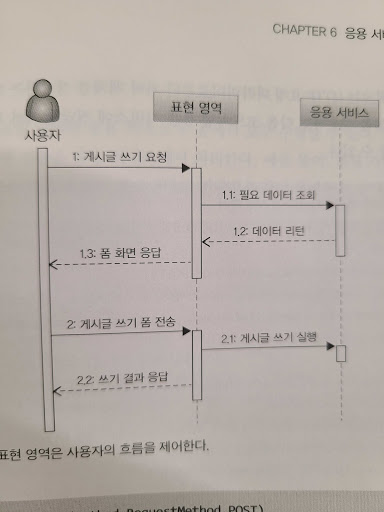

### 파라미터 값 검증
- 표현 영역과 응용 서비스 두 곳에서 모두 수행할 수 있다.
  - 원칙적으로는 모든 값에 대한 검증은 응용 서비스에서 처리
- 응용 서비스를 사용하는 표현 영역 코드가 한 곳이면 구현의 편리함을 위해 다음과 같이 역할을 나누어 검증을 수행할 수도 있다.
  - 표현 영역: 필수 값, 값의 형식, 범위 등을 검증
  - 응용 서비스: 데이터의 존재 유무와 같은 논리적 오류를 검증

### 권한 검사
- 영역별 권한 검사
- 표현 영역: 인증된 사용자인지 아닌지 여부를 검사. e.g. 서블릿 필터
- 응용 서비스: URL만으로 접근 제어를 할 수 없는 경우 메서드 단위로 권한 검사. e.g. Spring AOP
- 도메인: 애그리거트를 먼저 로딩해야 하는 경우 개별 도메인 단위로 검사. e.g. 본인 게시글 삭제
  
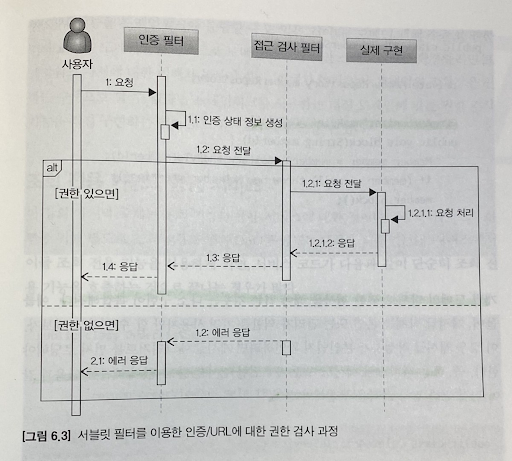
  
### 도메인 서비스
- 한 애그리거트에 넣기 애매한 도메인 개념을 구현한 서비스
- 응용 영역의 서비스가 응용 로직을 다룬다면 도메인 서비스는 도메인 로직을 다룬다.
- 도메인 서비스 객체를 애그리거트에 주입하지 않기
- 다른 도메인 구성 요소와 동일한 패키지에 위치한다.
- 도메인 서비스의 구현이 특정 구현 기술에 의존적이거나 외부 시스템의 API를 실행한다면 인터페이스로 추상화해야 한다.

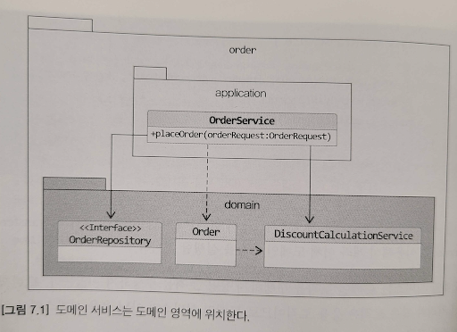

### 애그리거트 트랜잭션 관리
- 한 애그리거트를 두 사용자가 거의 동시에 변경할 때 트랜잭션이 필요하다.
- 트랜잭션마다 리포지터리는 새로운 애그리거트 객체를 생성한다.
- 이 상황에서 두 스레드가 각각 트랜잭션을 커밋할 때 수정한 내용을 DBMS에 반영하게 되어 애그리거트의 일관성이 깨진다.

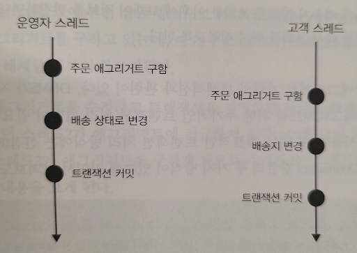

### 선점 잠금 (Pessimistic Lock)
- 먼저 애그리거트를 구한 스레드가 애그리거트 사용이 끝날 때까지 다른 스레드가 해당 애그리거트를 수정하는 것을 막는 방식
- 보통 DBMS가 제공하는 행 단위 잠금을 사용
  - select ~ for update와 같은 쿼리
- JPA의 find() 메서드에 LockModeType.PESSIMISTIC_WRITE
- 잠금 순서에 따른 교착 상태(deadlock)가 발생하지 않도록 주의해야 한다.
  (JPA에서 최대 대기 시간을 지정할 수 있음)
- 이 방식으로 모든 트랜잭션 충돌 문제가 해결되는 것은 아님

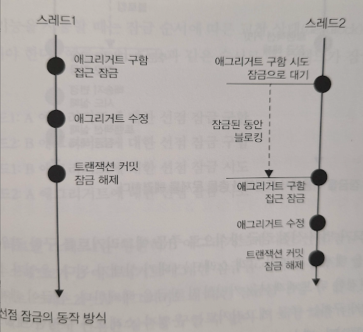
```java
  @Lock(LockModeType.PESSIMISTIC_WRITE)
  ReceivedEvent getByEventId(String eventId);
```

### 비선점 잠금 (Optimistic Lock)
- 변경한 데이터를 실제 DBMS에 반영하는 시점에 변경 가능 여부를 확인하는 방식
- 애그리거트에 버전으로 사용할 숫자 타입의 프로퍼티를 추가
  - JPA의 @Version을 붙여서 사용
- 현재 테이블의 버전값이 현재 애그리거트의 버전과 동일한 경우에만 데이터를 수정하고 수정할 때마다 버전의 값을 1씩 증가
- 쿼리 실행 결과로 수정된 행의 개수가 0이면 이미 데이터를 수정하여 버전이 증가된 경우
- 애그리거트 루트가 아닌 연관된 다른 엔티티의 값이 변경되더라도 루트의 버전을 증가한다.(JPA의 find() 메서드에 LockModeType.OPTIMISTIC_FORCE_INCREMENT)

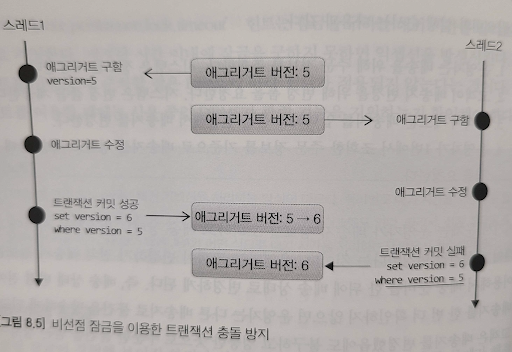
```java
  ...
  private OrderNo number;
  
  @Version
  private long version;
  ...
```

### Bounded Context 간 결합
- 직접 결합 - REST API 호출

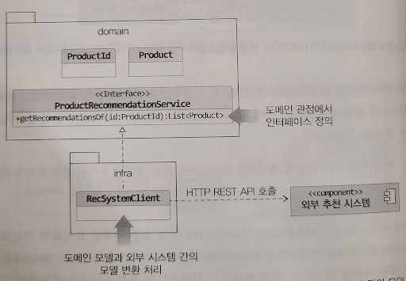

- 간적 결합 - 메시지 큐 사용

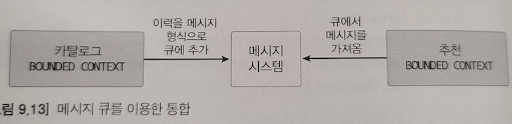

### Bounded Context 간 관계
- 가장 흔한 관계는 한 쪽에서 API를 제공하고 다른 한 쪽에서 그 API를 호출하는 관계
  - 상류 컨텍스트는 공급자, 하류 컨텍스트는 고객 역할
- `공개 호스트 서비스` (OHS, Open Host Service)
  - 상류 팀의 고객인 하류 팀이 다수 존재할 경우, 공개 API를 만들고 이를 서비스 형태로 공개 
  - 서비스의 일관성을 유지하기 위함
- 두 Bounded Context가 같은 모델을 공유하는 경우 이 모델을 `공유 커널`이라고 한다.
  - 장점: 중복 개발을 막을 수 있다.
  - 단점: 개발이 지연되고 정체되는 문제가 발생할 수 있다.
- 경우에 따라, 서로 통합하지 않고 독립적으로 모델을 발전시키는 방식인 `독립 방식`이 적용될 수 있다.

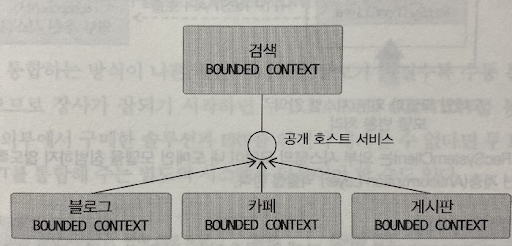

### 이벤트
- 도메인 객체에 서로 다른 도메인 로직이 섞이면 트랜잭션이나 성능, 설계의 문제를 일으킬 수 있다.
- 서로 다른 도메인 로직을 이벤트 처리를 통해 결합을 크게 낮출 수 있다.
- 이벤트 처리 지원 방법
  - 이벤트 클래스
  - EventHandler 인터페이스
  - 이벤트 디스패처인 Events 구현
  - 스프링 AOP를 이용한 Events.reset()
- 성능과 트랜잭션 범위 문제를 해소하기 위해 비동기 이벤트로 처리할 수 있다.

### CQRS (명령 및 조회 책임 분리)
- Command Query Responsibility Segregation
- 상태를 변경하는 범위와 상태를 조회하는 범위가 정확하게 일치하지 않기 때문에 단일 모델로 두 종류의 기능을 구현하면 모델이 복잡해진다.
- 복잡한 도메인에 적합
  - 명령 기능과 조회 기능의 범위에 차이가 발생
  - 조회 모델이 명령 모델에 영향을 주지 않는다.
- 각 모델에 맞는 구현 기술(다른 저장소) 선택 가능
  - 명령 모델: e.g. JPA를 이용한 도메인, RDBMS
  - 조회 모델: e.g. MyBatis를 이용한 DTO/DAO, NoSQL
- 일반적인 웹 서비스는 명령 요청보다 조회 요청이 많으므로 조회 성능을 높이기 위하여 적용

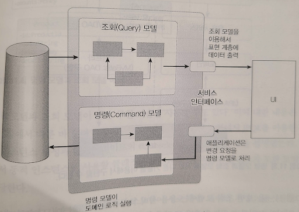

[< back](../README.md)
