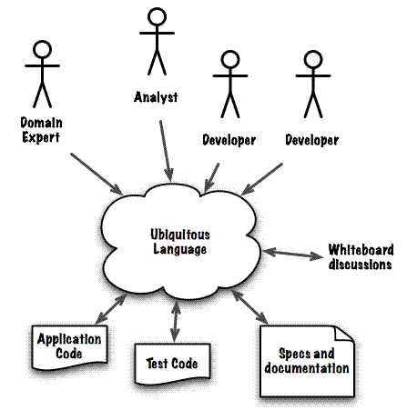

## 유비쿼터스 언어

### 유비쿼터스 언어 (Ubiquitous Language)
- 보편 언어
- 도메인 전문가, 분석가, 기획자, 개발자 등 프로젝트 구성원 모두에게 `공유된 언어`
    - 표준 비즈니스 용어나 도메인 전문가들의 은어는 아님
- 유비쿼터스 언어의 사용성
    - 구성원 간 의사소통
    - 설계 모델링, UML 작성 등
    - 설계를 바탕으로 구현 시 코드의 클래스명, 메소드명 정의
- 도메인의 의도를 정확히 반영하고 핵심 개념이 잘 표현될 수 있도록 정의
    - 구성원 간 각자의 언어를 사용하는 경우, 의사소통 비용발생
    - 커뮤니케이션의 오류는 프로젝트 진행의 병목 지점이 됨

[< back](../README.md)