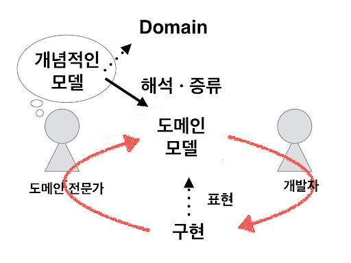
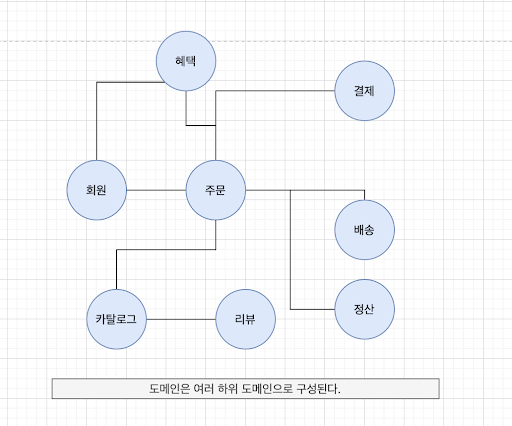
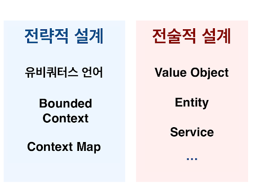

## What is DDD?

### DDD (Domain-Driven Design)

- 도메인 주도 설계
- 비즈니스 도메인 별로 나누어 설계하는 방식
- 도메인의 개념을 명확하게 표현
- 현업과 IT의 쌍방향 커뮤니케이션이 중요

### 도메인

- 사전적 의미로는 `정보와 활동의 영역`을 뜻함.
- 어떤 전문 분야에 대해 얘기할 때 "해당 도메인에 대한 지식이 필요하다"와 같이 말하기도 한다.
- 해결하고자 하는 `문제 영역`
    - 도메인은 여러 하위 도메인으로 구성한다.
- 소프트웨어는 도메인의 모든 기능을 제공하지 않을 수 있다.
    - e.g. 결제 - 외부PG, 배송 - 외부 물류

### 사용 목적
- 조직이 그 도메인에 유용한 `모델`을 얻는다.
- 정교하고 정확하게 site `정의`하고 이해한다.
- 도메인 전문가가 소프트웨어 설계에 `기여`한다.
- 사용자 경험이 `개선`된다.
- 순수한 모델 주변에 명확한 `경계`가 생긴다.
- 엔터프라이즈 아키텍처의 `구성`이 좋아진다.
- 전략적인 동시에 전술적인 새로운 `도구`가 적용된다.

### 설계 방식

[< back](../README.md)

